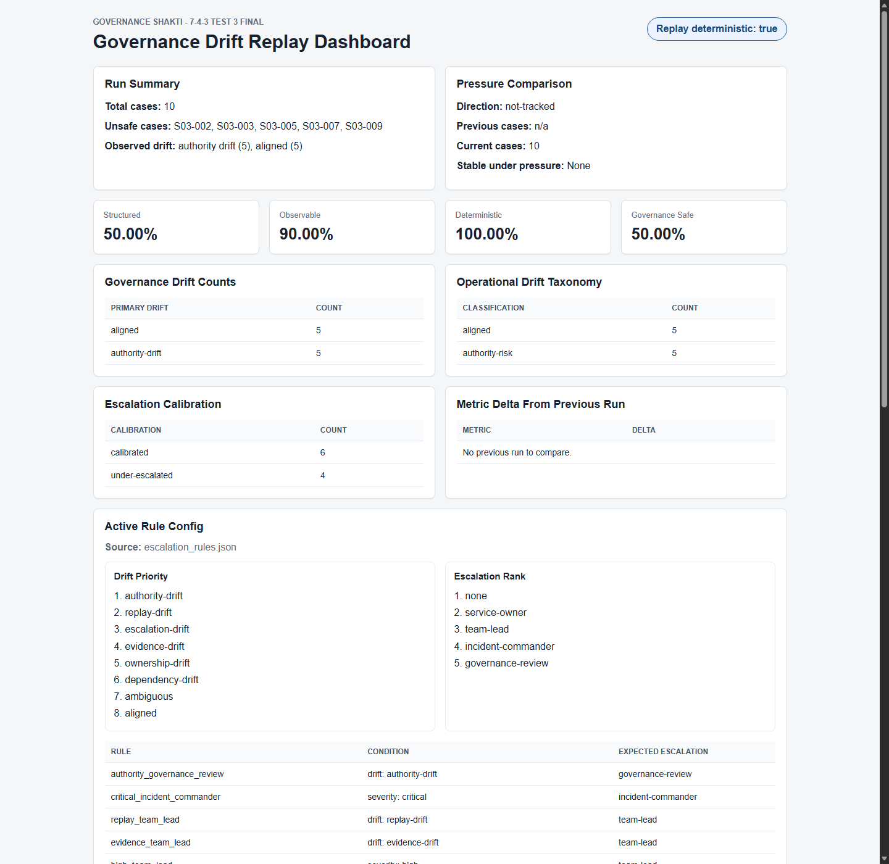

# Governance Drift Replay

## Objective

Make messy operational updates structured, observable, deterministic, and safely interpretable.

The project takes raw governance/operations updates, classifies drift, checks escalation calibration, and writes inspectable JSON, CSV, and HTML outputs.

## Quick Start

Run the default example:

```powershell
python governance_replay.py --full --no-open
```

Open the dashboard automatically:

```powershell
python governance_replay.py --full
```

Run with a different input file:

```powershell
python governance_replay.py --input your_updates.json --full --no-open
```

Run in scheduled/stateful mode:

```powershell
python governance_replay.py --input samples/00_default_example/input_updates.json
```

Stateful mode analyzes only records newer than the last saved timestamp and writes a new `outputs/last_run_state.json`.

## What The Program Does

1. Reads messy updates from JSON.
2. Parses each update into structured fields.
3. Applies visible rules from `escalation_rules.json`.
4. Classifies governance drift and operational drift.
5. Calculates expected escalation.
6. Compares expected escalation with actual escalation.
7. Replays the same selected input twice to check determinism.
8. Compares scheduled runs to detect pressure changes.
9. Writes JSON, CSV, and HTML outputs.

## Main Output Files

The `outputs/` folder is generated when the program runs. It is ignored by git because the submitted proof is already saved under `samples/`.

Generated runtime outputs:

| File | Purpose |
|---|---|
| `outputs/structured_updates.json` | parsed structured result for each update |
| `outputs/replay_results.json` | full replay, drift, calibration, and summary result |
| `outputs/pressure_comparison.json` | current run compared with previous run |
| `outputs/rules_used.json` | exact rule config loaded for that run |
| `outputs/last_run_state.json` | state used by the next scheduled run |
| `outputs/escalation_report.csv` | spreadsheet-friendly report |
| `outputs/dashboard.html` | generated dashboard |
| `outputs/dashboard.css` | stylesheet copied beside the dashboard |

## Sample Evidence Suite

The `samples/` folder is the main proof package. It contains saved inputs, outputs, dashboards, screenshots, and notes.

Start here:

- [Default example notes](samples/00_default_example/notes.md)
- [Default example input](samples/00_default_example/input_updates.json)
- [Default example dashboard](samples/00_default_example/dashboard.html)
- [Default example screenshot](samples/00_default_example/screenshot.png)
- [Full sample index](samples/README.md)

Example messy input:

```json
{
  "case_id": "S03-001",
  "timestamp": "2026-05-29T09:10:00Z",
  "update": "Payments manual override completed without approval by unauthorized contractor. No escalation."
}
```

Example dashboard screenshot:



## Sample Index

### 00 Default Example

Proves: default input and complete output set  
Notes: [notes](samples/00_default_example/notes.md)  
Input: [input](samples/00_default_example/input_updates.json)  
Dashboard: [dashboard](samples/00_default_example/dashboard.html)  
Screenshot: [screenshot](samples/00_default_example/screenshot.png)

### 01 Aligned

Proves: aligned behavior  
Notes: [notes](samples/01_aligned/notes.md)  
Input: [input](samples/01_aligned/input_updates.json)  
Dashboard: [dashboard](samples/01_aligned/dashboard.html)  
Screenshot: [screenshot](samples/01_aligned/screenshot.png)

### 02 Missing Evidence

Proves: missing evidence / observability drift  
Notes: [notes](samples/02_missing_evidence/notes.md)  
Input: [input](samples/02_missing_evidence/input_updates.json)  
Dashboard: [dashboard](samples/02_missing_evidence/dashboard.html)  
Screenshot: [screenshot](samples/02_missing_evidence/screenshot.png)

### 03 Authority Drift

Proves: missing approval / unauthorized actor  
Notes: [notes](samples/03_authority_drift/notes.md)  
Input: [input](samples/03_authority_drift/input_updates.json)  
Dashboard: [dashboard](samples/03_authority_drift/dashboard.html)  
Screenshot: [screenshot](samples/03_authority_drift/screenshot.png)

### 04 Replay Mismatch

Proves: replay mismatch  
Notes: [notes](samples/04_replay_mismatch/notes.md)  
Input: [input](samples/04_replay_mismatch/input_updates.json)  
Dashboard: [dashboard](samples/04_replay_mismatch/dashboard.html)  
Screenshot: [screenshot](samples/04_replay_mismatch/screenshot.png)

### 05 Under Escalated

Proves: escalation too low  
Notes: [notes](samples/05_under_escalated/notes.md)  
Input: [input](samples/05_under_escalated/input_updates.json)  
Dashboard: [dashboard](samples/05_under_escalated/dashboard.html)  
Screenshot: [screenshot](samples/05_under_escalated/screenshot.png)

### 06 Over Escalated

Proves: escalation too high  
Notes: [notes](samples/06_over_escalated/notes.md)  
Input: [input](samples/06_over_escalated/input_updates.json)  
Dashboard: [dashboard](samples/06_over_escalated/dashboard.html)  
Screenshot: [screenshot](samples/06_over_escalated/screenshot.png)

### 07 Pressure Increase

Proves: pressure comparison across runs  
Notes: [notes](samples/07_pressure_increase/notes.md)  
Input: [input](samples/07_pressure_increase/input_updates.json)  
Dashboard: [dashboard](samples/07_pressure_increase/dashboard.html)  
Screenshot: [screenshot](samples/07_pressure_increase/screenshot.png)

### 08 Ambiguous Input

Proves: vague/mangled input handling  
Notes: [notes](samples/08_ambiguous_input/notes.md)  
Input: [input](samples/08_ambiguous_input/input_updates.json)  
Dashboard: [dashboard](samples/08_ambiguous_input/dashboard.html)  
Screenshot: [screenshot](samples/08_ambiguous_input/screenshot.png)

### 09 Conflict Handling

Proves: deterministic priority when one update has multiple drift signals  
Notes: [notes](samples/09_conflict_handling/notes.md)  
Input: [input](samples/09_conflict_handling/input_updates.json)  
Dashboard: [dashboard](samples/09_conflict_handling/dashboard.html)  
Screenshot: [screenshot](samples/09_conflict_handling/screenshot.png)

## Drift And Calibration Labels

Governance drift labels:

- `aligned`
- `authority-drift`
- `replay-drift`
- `escalation-drift`
- `evidence-drift`
- `ownership-drift`
- `dependency-drift`
- `ambiguous`

Operational taxonomy preserved from the earlier task:

- `aligned`
- `replay-risk`
- `authority-risk`
- `observability-risk`
- `integration-risk`
- `unclear/incomplete`

Escalation calibration:

- `calibrated`
- `under-escalated`
- `over-escalated`

Conflict handling:

When one update matches several drift labels, the program keeps every matching label in `drift_types`, stores the non-primary labels in `secondary_drifts`, and explains the selected primary label in `conflict_resolution`.

## Rule Visibility

The rule config is intentionally visible instead of hidden in the code.

Rule files:

- [RULES.md](RULES.md)
- [escalation_rules.json](escalation_rules.json)

Each run also writes `rules_used.json` beside the other outputs, and the dashboard includes an `Active Rule Config` section showing priority order, escalation rank, escalation rules, and keyword groups.

## Pressure Comparison

For scheduled monitoring, omit `--full`.

The program saves a state snapshot after each run and compares:

- previous case count vs current case count
- structured rate
- observable rate
- deterministic rate
- governance-safe rate

If the current run has more new records, pressure increased. If any metric drops during that increase, the dashboard shows that operational intelligence did not remain stable under pressure.

## Test Stream Generator

`governance_stream_generator.py` is only for testing. It appends fake messy updates to a JSON file.

Create a fresh test input:

```powershell
python governance_stream_generator.py --output outputs/generated_updates.json --reset --count 7 --seed 1
```

Append more updates:

```powershell
python governance_stream_generator.py --output outputs/generated_updates.json --count 10 --seed 2
```

Then run:

```powershell
python governance_replay.py --input outputs/generated_updates.json --full --no-open
```

## Project Files

| File | Purpose |
|---|---|
| `governance_replay.py` | main parser, replay engine, calibration logic, pressure comparison, and output writer |
| `governance_stream_generator.py` | optional fake input generator for testing pressure |
| `RULES.md` | readable explanation of the rule config |
| `escalation_rules.json` | visible deterministic rules |
| `dashboard.css` | dashboard stylesheet |
| `samples/` | curated evidence suite |
| `REVIEW_PACKET.md` | concise reviewer-facing explanation |

## Limitation

This is rule-based. It is deterministic and inspectable, but it will miss wording that is not covered by the rules.
